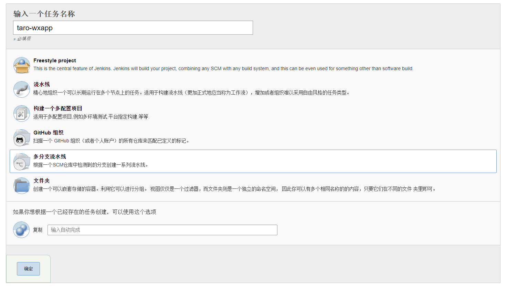
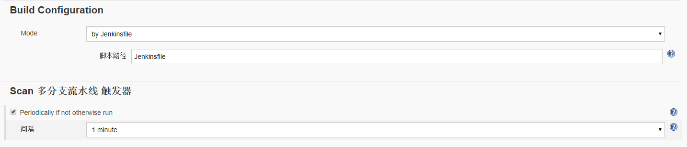
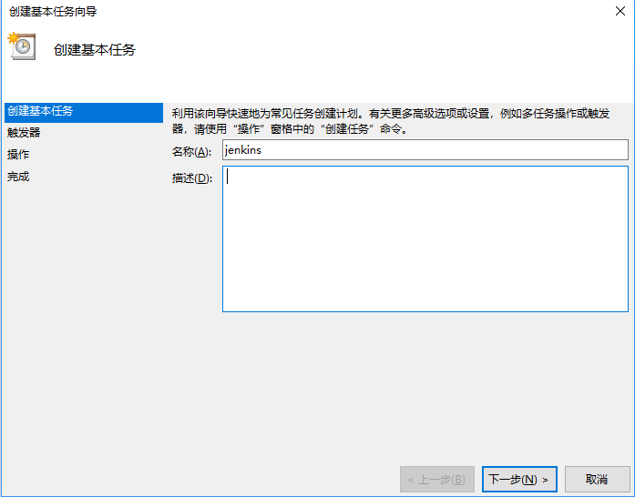
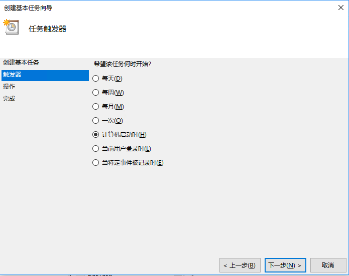
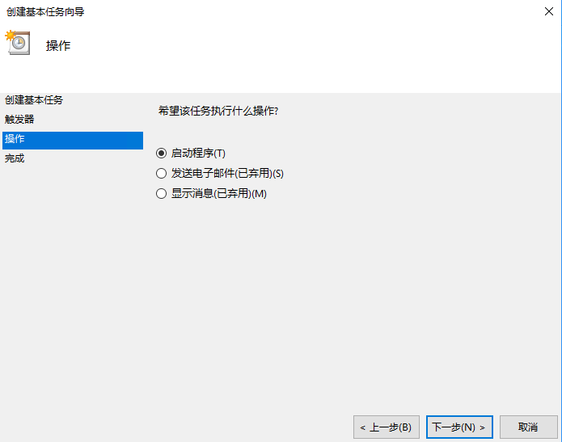
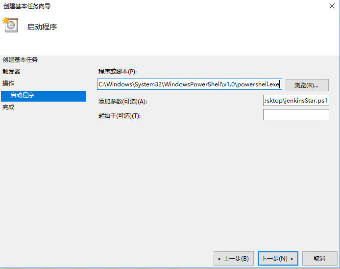
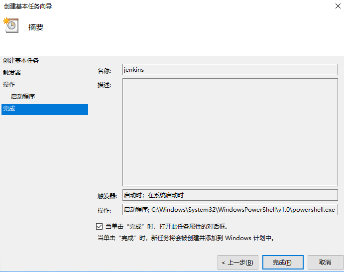
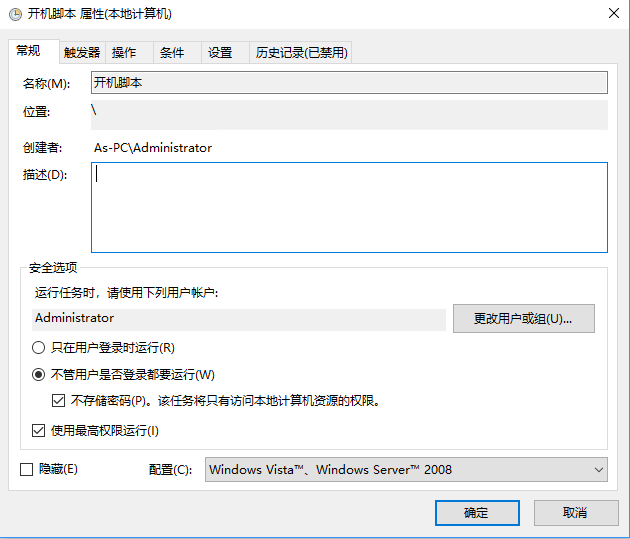

# Jenkins 集成多分支Taro微信小程序

微信开发者工具中虽然集成了预览、上传功能，但是在微信小程序的管理后台，每个开发者上传的版本都是独立的。

如果是多人协作开发，其中一个开发者在修复了 BUG，或者新增了功能，想要上传体验版给测试时，还要登陆后台重新设置体验版，然后再把体验版的二维码发给测试。  
每次都要这么操作一番，效率又低，还打断开发者的思路。

万一你请假了，同事帮你改点东西，有可能还没办法上传，还得在你的休息日夺命连环 call 你。更是体验极差。

所以我们采用 Jenkins 持续部署的方式来自动部署上传小程序，免去人工的烦恼。

> 大家可以看一看大佬已经部署成功的文章 [微信小程序集成 Jenkins](https://github.com/yingye/Blog/issues/8)

由于需求跟上面大佬的不太一样，我们公司使用的是 Taro 框架来开发小程序，并且同一个项目下有多个分支都需要进行发布部署。因此也需要进行一些修改。

[Taro](https://taro.aotu.io/)是京东旗下凹凸实验室推出的一款使用React语法进行多端统一开发的解决方案。  
  

支持微信小程序、H5、百度小程序、支付宝小程序、快应用、ReactNative、字节跳动小程序、QQ 轻应用。可以说是目前小程序开发框架中支持最齐全的了。

下面我们就来讲解如何在Jenkins里集成多分支Taro小程序项目

在继承部署中需要微信开发者工具，目前微信开发者工具只有 macOS 和 Windows 两种版本,上文的大佬用的是 macOS 系统，本文采用 Windows 系统进行部署

下面讲解下具体步骤

- #### 安装 Jenkins
这个步骤和上文大佬的文章是一样的

Jenkins 依赖 java1.8，需要首先在我们的服务器上安装 java1.8 版本。之后 [直接下载最新的稳定 Jenkins WAR 包](http://mirrors.Jenkins.io/war-stable/latest/Jenkins.war)，
然后**以管理员身份运行 powershell**，并执行以下命令启动 Jenkins

```shell
java -jar Jenkins.war --httpPort=8888
```

其中，`--httpPort=8888` 为设置服务端口号，默认端口号为 8080 。

> 注意执行时 powershell 所在的文件夹地址要对

- #### 新建多分支流水线任务
这里与上面大佬的文章就有区别了。  
为了让每个分支都可以有自己的部署策略，所以我们选择使用多分支流水线任务的方式来部署任务  


- #### 配置任务

##### 1、配置源码及分支


我们在Branch Sources中选择git源。填入仓库地址，选择适合你的验证方式。  

在Behaviours中，我们可以通过新增`Filter by name`的配置项来筛选分支，例如我们现在只希望自动部署以dev开头的分支，那么就填写`dev*`。

##### 2、配置触发器



如图所示，我们使用Jenkinsfile来配置流水线。  

触发器间隔选择1分钟。相当于每隔一分钟Jenkins会查看一下你的git仓库中有没有更新。如果有更新就会触发自动部署流程。你可以选择合适你的触发间隔。

现在我们的Jenkins任务配置就已经完成了，点击保存按钮即可。

- #### 编写Jenkinsfile

Jenkinsfile是Jenkins流水线任务的声明方法之一，具体可以大家可以查看[Jenkinsfile介绍](https://Jenkins.io/zh/doc/book/pipeline/Jenkinsfile/)  

首先我们在git项目的根目录下创建一个Jenkinsfile文件  
如果想创建在其他位置，那么需要调整上面配置触发器部分的 `脚本路径` 选项


``` Groovy 
// Jenkinsfile内容
pipeline {
    agent any
    options{
        retry(3)
        timeout(time:10, unit: 'MINUTES')
    }
    stages {
       stage('start') {
          steps {
            echo '构建开始...'
          }
        }
       stage('build') {
          //  在这里也可以设置一些条件，例如分支名称过滤等
          when { branch 'dev*' }
          steps {
            // Windows下使用bat启动脚本，linux或manOS下使用sh启动脚本
            bat 'powershell ./deploy.ps1'
          }
        }
    }
   post {
       success {
            echo '构建成功'
          }
       failure {
            echo '构建失败'
          }
    }
}
```

- #### 编写部署脚本
上面的Jenkinsfile中我们可以看到，在build阶段我们启动了一个名字叫做deploy.ps1的PowerShell脚本。我们的部署、编译、上传等步骤都放在脚本中进行。  

在我们实际应用中开发们可以直接使用开发者工具进行预览，测试们使用体验版进行测试，所以不需要预览二维码，如果需要预览二维码请参考上文大佬的文章。

首先确认服务器中已经安装了nodejs、微信开发者工具  
微信开发者工具必须是已经登陆的状态。最好可以申请一个自动构建专用的微信账号。  
在微信开发者工具的安全设置中开启服务端口   
Taro的cli需要在项目本地安装

微信小程序在上传时可以填写版本号，版本号也可以有效的帮助我们区分当前体验版的版本，因此我们在根目录下新建一个 `version` 文件，将版本号写进去，脚本会自动读取版本号并上传
```
1.0.0
```

项目根目录下新增 `deploy.ps1` 文件
```PowerShell
# deploy脚本代码
Write-Output "下载npm包"
npm i --registry=http://registry.npm.taobao.org
Write-Output "开始编译"
# 这里使用的是开发模式编译，如果需要生产模式，将末尾的 --env development 去掉就可以了
.\node_modules\.bin\taro build --type weapp --env development
Write-Output "读取版本和编译地址"
$version = Get-Content ./version
Write-Output $version
Write-Output "上传代码"
$path = (Get-Location).Path + "\dist"
$p1 = $version + "@" + $path
Write-Output $path
Write-Output $p1
# 需要修改为你自己的微信web开发者工具安装目录
& 'C:\Program Files (x86)\Tencent\微信web开发者工具\cli' -o $path
Start-Sleep -Seconds 10
& 'C:\Program Files (x86)\Tencent\微信web开发者工具\cli' -u $p1 --upload-desc '自动构建'
Write-Output "关闭当前项目"
& 'C:\Program Files (x86)\Tencent\微信web开发者工具\cli' --close $path
& 'C:\Program Files (x86)\Tencent\微信web开发者工具\cli' --quit
```

> 在这里我遇到了一个微信开发者工具的BUG，由于是多分支模式，每个分支必然会长的比较像。也可能存在某些页面或文件在分支A中存在，分支B中不存在。这时候假如分支A上传成功，我们又触发了分支B的自动部署，命令行模式下的微信开发者工具会报错说找不到分支A的某些文件。GUI手动模式下则没有问题。解决办法是将微信开发者工具完全关闭再重新打开。

- #### 设置Jenkins开机自启动

Windows10的自动更新已经饱受诟病多时了。Windows10强制要求每35天系统至少更新并重启一遍，每次重启我们还需要手动开启Jenkins也是一件很麻烦的事。因此我们给它配置一个开机自启动。

首先创建一个Jenkins的启动脚本 `JenkinsAutoStar.ps1`
```PowerShell
java -jar "D:\Java\Jenkins.war" --httpPort=8888
```
  
##### 1、打开计划任务，创建一个新的基本任务



##### 2、在触发器中选择 `计算机启动时`



##### 3、在操作中选择 `启动程序`



##### 4、填写启动程序配置
```
程序或脚本中填写
C:\Windows\System32\WindowsPowerShell\v1.0\powershell.exe
添加参数中填写
C:\Users\your PC\Desktop\JenkinsStar.ps1
```


##### 5、勾选 `单击万成时打开此任务属性对话框` 并点击完成



##### 6、配置权限

用户账户使用 `Administrator`  
勾选 `使用最高权限运行`  
点击确定



现在我们已经成功部署了Jenkins的开机启动


以上就是Jenkins集成多分支Taro小程序的全部内容，作者水平有限，如有不清楚的地方或者错误欢迎大家批评指正～
