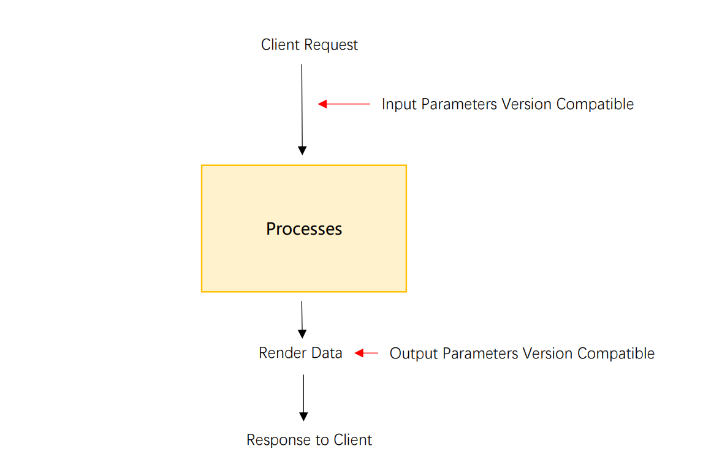

# 服务端版本的兼容的一些想法

在项目开发过程中，我们经常会遇到由于业务升级，需要对client端的入参和出参进行版本兼容的情况

为了便于统一管理，一般我们会考虑在client的request处拦截请求所携带的参数，将参数处理成我们需要的格式，同时在render response之前拦截需要render的data，再将其处理成client版本所需要的格式




分别创建InputVersioncompatible和OutputVersioncompatible，并在其中增加版本信息相关的描述和兼容代码

例：

```ruby
  # InputVersioncompatible例
  def case_params_perform
    if app_version_android < 126
      params = case_v126(params)
    end

    do_processing(params)
  end

  def case_v126(params)
    params[:data]['road_id'] = ['road', params[:data]['road_id']] if params[:data]['road_id'].is_a(String)
    params
  end
```

这样一个简单的版本兼容代码就完成了   
在版本小于126时，我们将road_id变成数组，并且在数组首位增加一个默认'road'的标签

但是当我们需要维护兼容的版本增多的时候，就有些麻烦了  
例如现在我们的127版本，需要用户再新增一个weather，当未提供weather时默认是晴天
我们很容易就可以新增一个方法
```ruby
  # InputVersioncompatible例
  def case_params_perform
    if app_version_android < 126
      params = case_v126(params)
    elsif app_version_android < 127
      params = case_v127(params)
    end

    do_processing(params)
  end

  def case_v127(params)
    params[:data]['weather'] = 'sunny' unless params[:data]['weather']
    params
  end
```
但是请注意，这里有一个错误，我们仅仅在版本号等于126的时候会执行```case_v127```   
版本号低于126的时候，就丢掉了weather的默认设置   
我们再次稍微改动一下代码，就变成了
```ruby

  # InputVersioncompatible例
  def case_params_perform
    if app_version_android < 126
      params = case_v126(params)
    end
    if app_version_android < 127
      params = case_v127(params)
    end
  end
```
看起来不错，问题解决了，但是这一大堆 if end放在这里，代码比较丑，有什么好的办法解决么  

我们尝试利用职责链的思路来优化一下代码  
职责链是指将请求发送到一条处理链上，让这条链上的所有处理者自行判断是否需要处理，每个处理者可以选择仅处理自己承担的一部分内容  
下面我们对代码进行改造  
```ruby
  # InputVersioncompatible例
  def case_params_perform
    # 通过reduce方法将所有版本兼容方法收缩到一条链上
    params = %i[case_v126 case_v127].reduce(params) { |pre, curr| send(curr, pre) }

    do_processing(params)
  end

  def case_v126(params)
    return params if app_version_android >= 126

    params[:data]['road_id'] = ['road', params[:data]['road_id']] if params[:data]['road_id'].is_a(String)
    params
  end

  def case_v127(params)
    return params if app_version_android >= 127

    params[:data]['weather'] = 'sunny' unless params[:data]['weather']
    params
  end
```

这样代码是不是看起来漂亮很多，并且我们对版本的判断放在了方法内部，比起罗列一大堆if语句，这样更不容易出错  

到这里我们差不多比较优雅的解决了兼容问题，不过好像还缺点什么  
让我们重新看看上面那张图


我们还缺OutputVersionCompatible呢！
那么我们再把上面的代码再复制一份，之后再将它放在合适地点，问题解决  

等等，我们就不能把入参和出参的控制放在一起吗？  
如果代码能够像下面这样运行，那岂不是同一个版本的入参和出参能够放在一起了？
```ruby
  # 将下一个版本的处理方法传递到当前版本中
  def version_perform(params,next_version_perform)
    # 处理入参
    # do_something_for_params
    params
    # 出参由下一版本处理方法返回
    result = next_version_perform.call(params)

    # 处理出参
    # do_something_for_result
    result
    # 返回出参
    return result
  end
```

大部分主流语言已经实现了lambda表达式的定义，我们试着来改写程序，实现上面的逻辑  

```ruby
  # 统一创建lambda表达式
  def create_perform(ver)
    lambda { |next_version_perform|
      return lambda do |params|
        return next_version_perform.(params) if app_version_android >= ver

        yield(params, next_version_perform)
      end
    }
  end

    def case_v126_wrap
    create_perform(126) do |params, next_version_perform|
      # 将road_id由 '1' 变成 ['road','1']
      params[:data]['road_id'] = ['road', params[:data]['road_id']] if params[:data]['road_id'].is_a(String)

      result = next_version_perform.(params)

      # 将road_id由 ['road','1'] 还原回 '1'
      result['road_id'] = result['road_id'][1] if result['road_id'].is_a(Array)
      result
    end
  end

  def case_v127_wrap
    create_perform(127) do |params, next_version_perform|
      # 增加默认天气
      params[:data]['weather'] = 'sunny' unless params[:data]['weather']

      result = next_version_perform.(params)

      # 删除默认天气
      # result.delete('weather')
      result
    end
  end

  # 最后我们再把所有的方法包装起来
  def case_params_perform
    main_processing = lambda do |params|
      do_processing(params)
    end
    # 需要注意的是，由于我们需要版本最小的控制器在最外层，所以这里我们要把版本控制器的排序倒过来
    proc = [case_v127_wrap, case_v126_wrap].reduce(main_processing) do |pre, curr|
      curr.(pre)
    end

    proc.(params)
  end
```

现在我们才真正完成了版本入参和出参的双向控制  